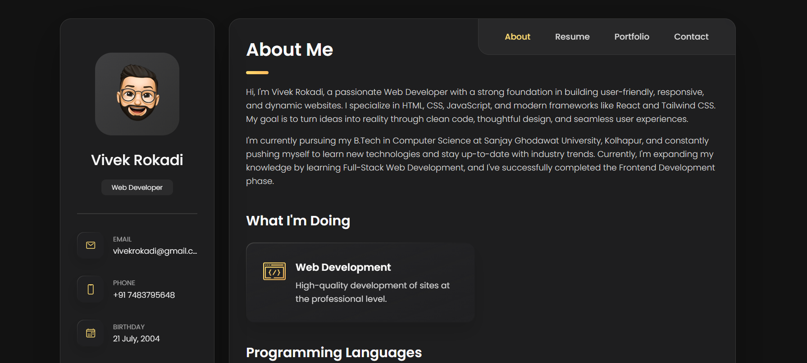
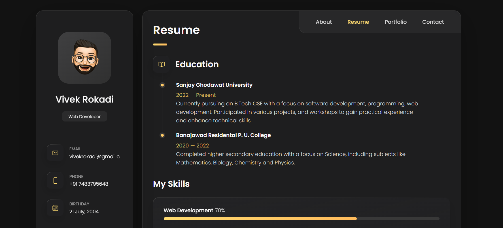
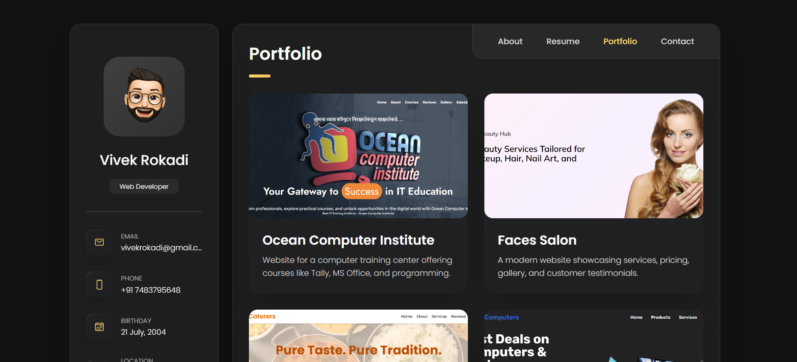

# 🌐 Personal Portfolio Website

Welcome to my **Personal Portfolio Website** – a digital space to showcase my work, skills, and passion for web development.

🔗 **Live Demo**: [vivekrokadi-portfolio.vercel.app](https://vivekrokadi-portfolio.vercel.app/)

## 🛠️ Built With

- **HTML5** – Semantic structure and accessibility
- **CSS3** – Custom styling with responsive design
- **JavaScript** – Interactive UI and functionality

## 📂 Features

- Clean and responsive layout
- About Me section with professional details
- Projects showcase with links
- Contact form
- Scroll animations and interactive elements

## 🚀 Deployment

This website is deployed using **Vercel**.  
Check it out live: [https://vivekrokadi-portfolio.vercel.app](https://vivekrokadi-portfolio.vercel.app)

## 📸 Screenshots

|  |  |  |

## 🙋‍♂️ About Me
I’m Vivek Rokadi, a passionate web developer exploring modern web technologies and building practical, real-world projects.
Feel free to connect with me or explore more of my work!

